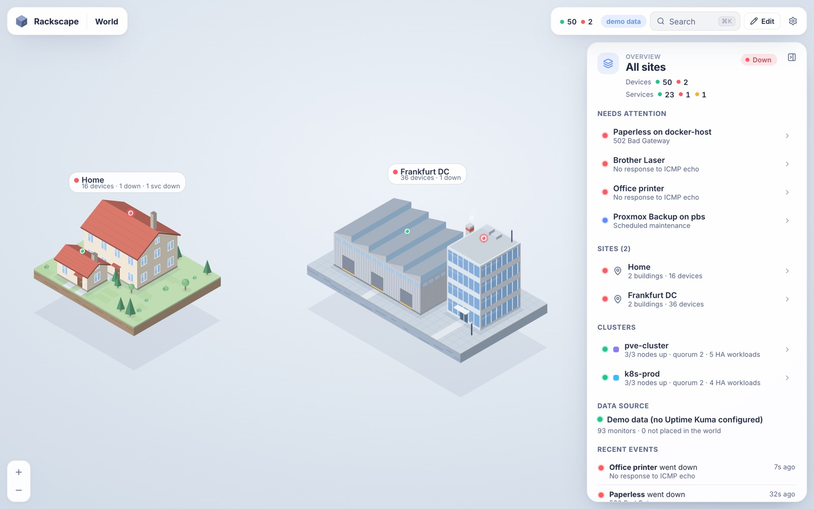
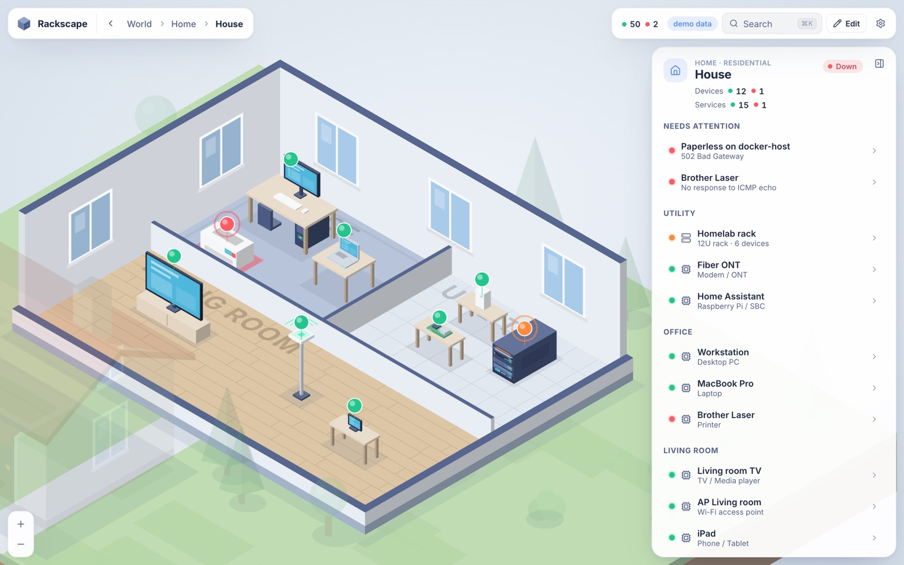

[](./LICENSE.md)

# Rackscape

**Your racks as a landscape.** An explorable, isometric world of your infrastructure – sites, buildings, rooms, racks, servers, VMs and services – with live status from **Uptime Kuma**.

Instead of a list of monitors you get one continuous world: click a site and the camera flies onto its island, click a building and the roof lifts off, click a rack and it fills the screen, click a server and it slides out like a drawer while its VMs and services float above it as a hologram. Every LED, pin and beacon reflects the live state of your Kuma monitors.



| Site | Inside a building |
| --- | --- |
|  |  |
| **Rack** | **Server with VMs, services and HA cluster workloads** |
|  |  |

## Features

- **One world, many levels** – World → Site → Building → Rack → Machine → Service, all in a single isometric scene with smooth camera flights (no page changes). Deep links via the URL, back with <kbd>Esc</kbd>.
- **Hand-drawn look** – procedural SVG art in the style of classic isometric illustrations: floating island plots, houses with gable roofs, office towers, sawtooth-roof factories, raised server-room floors with vent tiles, racks with blinking port LEDs, desks, laptops, TVs, access points, cameras, printers …
- **Live status** – green/red LEDs on devices, status pins, rack status strips, roof beacons and site labels roll up the worst state inside (down › degraded › pending › maintenance › up). Down things pulse; desktop screens turn red.
- **Building types** – residential, commercial, industrial; single floor with rooms (raised floor, concrete, wood, carpet, tiles).
- **Device types** – servers (1U–nU), switches, routers, firewalls, NAS, UPS (rack & tower), patch panels, PDUs, KVMs, blanks, tower servers, desktops, laptops, mini PCs, Raspberry Pis, modems, access points, cameras, printers, smart-home hubs, TVs, phones/tablets, IoT devices.
- **Host + services** – each device has an optional host monitor (drives its main LED) plus any number of service monitors, VMs, LXCs and containers – each with their own services.
- **Clusters (Proxmox HA, Kubernetes, Swarm …)** – group devices anywhere in the world. Workloads attached to a cluster "float" between members: they show up above every member and the cluster's health is judged by quorum. Highlighting a cluster opens the relevant buildings and draws animated links between its members.
- **Details panel** – heartbeat bar, response-time chart (1h/24h/7d), uptime 24h/30d, certificate expiry, last error, event log, inventory (IP, OS, CPU, RAM, serial, notes …), rack elevation.
- **In-app editor** – add sites, buildings, rooms, racks and devices; drag things around the world; pick Kuma monitors from a searchable picker with suggestions; bulk-add services from Kuma; undo/redo; autosave; version history; JSON import/export.
- **Search** – <kbd>⌘K</kbd> / <kbd>Ctrl K</kbd> flies the camera to any site, device, VM or service.
- **Alerts** – toasts, optional desktop notifications, favicon and tab title reflect the current state.
- **Light & dark** themes, **mobile friendly** (touch pan/pinch, bottom sheet).
- **Demo mode** – runs without Kuma using a sample home + datacenter with fake, flapping monitors.

## Deploy with Portainer

1. **Stacks → Add stack → Repository**
2. Repository URL: `https://github.com/yniverz/rackscape`, compose path: `docker-compose.yml`
3. Add environment variables (at least):

   | Variable | Example | |
   | --- | --- | --- |
   | `KUMA_URL` | `http://192.168.1.10:3001` | Kuma as reachable **from the container** |
   | `KUMA_USERNAME` | `admin` | a Kuma user |
   | `KUMA_PASSWORD` | `…` | |
   | `ADMIN_PASSWORD` | `…` | login for this app (generated & logged if empty) |

4. Deploy, open `http://<host>:3000`, click **Edit** and start building your world.

The stack uses the prebuilt image `ghcr.io/yniverz/rackscape:latest` (amd64 and arm64), which GitHub Actions publishes on every push. To update, use **Pull and redeploy** with **Re-pull image** enabled – it only downloads the new image, so it takes seconds.

To build from source on your own server instead, replace the `image:` line in `docker-compose.yml` with `build: .` and `pull_policy: build` (this takes a few minutes per deploy).

> If Kuma runs in another stack on the same host, either use the host IP, or attach both containers to a shared Docker network and use `http://uptime-kuma:3001`.

### Plain Docker

```bash
git clone https://github.com/yniverz/rackscape.git
```

```bash
cd rackscape && KUMA_URL=http://192.168.1.10:3001 KUMA_USERNAME=admin KUMA_PASSWORD=secret ADMIN_PASSWORD=change-me docker compose up -d
```

## Configuration

| Variable | Default | Description |
| --- | --- | --- |
| `KUMA_URL` | – | Base URL of Uptime Kuma. Without it the app runs in demo mode. |
| `KUMA_USERNAME` / `KUMA_PASSWORD` | – | Kuma credentials. Not needed if Kuma has authentication disabled. |
| `KUMA_TOTP_SECRET` | – | Base32 2FA secret, only if the Kuma account uses 2FA. |
| `KUMA_PUBLIC_URL` | `KUMA_URL` | Kuma URL as seen by your browser (for "open in Kuma" links). |
| `ADMIN_USERNAME` | `admin` | Login for this app. |
| `ADMIN_PASSWORD` | generated | Printed to the log and stored in `/data/admin-password.txt` if unset. |
| `PUBLIC_READ` | `false` | Anyone may view without logging in; editing still requires login. |
| `AUTH_DISABLED` | `false` | No login at all (use behind Authelia/Authentik/VPN). |
| `DEMO_MODE` | auto | `true` forces fake data even when `KUMA_URL` is set. |
| `SESSION_DAYS` | `30` | Login lifetime. Changing `ADMIN_PASSWORD` logs out all sessions. |
| `TRUST_PROXY` | `loopback,linklocal,uniquelocal` | Which reverse proxies may set `X-Forwarded-*` (`true`, `false` or a list). |
| `FRAME_ANCESTORS` | `'self'` | CSP `frame-ancestors`, e.g. `'self' https://dash.example.com` to embed the page in a dashboard. |
| `PORT` | `3000` | HTTP port inside the container. |
| `DATA_DIR` | `/data` | SQLite database (layout, history, event log) and secrets. Mount it as a volume. |

### How the Kuma connection works

Uptime Kuma has no full REST API, so Rackscape connects like Kuma's own web UI: over Socket.IO, as a logged-in user. It receives the monitor list and live heartbeats in real time and asks Kuma for history when you open a detail panel. Both Kuma 1.x/2.0–2.5 (socket login) and the newer better-auth based versions (cookie session) are supported and detected automatically. Consider creating a dedicated Kuma user. The connection is read-only; nothing in Kuma is changed.

### Security notes

- Put the app behind HTTPS (e.g. your reverse proxy) when it is reachable from outside your LAN; the session cookie is marked `Secure` automatically on HTTPS.
- Logins are rate limited; sessions are HMAC-signed cookies (`HttpOnly`, `SameSite=Lax`). Cross-origin write requests are rejected and a strict Content-Security-Policy is sent.
- Layout data is sanitised on the server: only `http(s)` links are kept, colours must be hex, numbers are clamped.
- The Kuma account is only used for reading. Use a dedicated Kuma user if you prefer.
- Kuma with a self-signed certificate: set `NODE_TLS_REJECT_UNAUTHORIZED=0` (affects all outgoing TLS from this container) or use Kuma's plain HTTP URL inside your network.

## Using it

- **Navigate**: click to go deeper, <kbd>Esc</kbd> or the breadcrumb to go back, drag to pan, scroll/pinch to zoom.
- **Edit**: press <kbd>E</kbd> or click **Edit**. Click to select, double-click to go inside, drag to rearrange (snaps to the floor grid, hold <kbd>Alt</kbd> for ¼ steps, items don't overlap), <kbd>R</kbd> to turn the selected rack/device around, <kbd>⌘Z</kbd>/<kbd>⇧⌘Z</kbd> to undo/redo, <kbd>Del</kbd> to delete.
- **Link monitors**: in a device's inspector choose its *host monitor*, add *services* (or **From Kuma…** to add several at once) and *VMs & containers*. Matching monitors (by name or IP) are suggested.
- **Clusters**: **Manage clusters** → add members, HA VMs and cluster services. A Proxmox HA VM defined on the cluster shows up above every member.

## Development

```bash
npm install
```

```bash
npm run dev
```

Runs the API on `:3000` (demo mode unless `KUMA_URL` is set) and the Vite dev server on `:5173`.

```
server/   Fastify API, Kuma Socket.IO client, SQLite (node:sqlite), SSE stream
shared/   world model + status types used by both sides
web/      React + Vite; web/src/scene = the isometric SVG renderer
```

The world model (`shared/model.ts`) uses globally unique ids for every entity, so upcoming features such as network/VPN topology views can reference sites, devices and services directly.

## Roadmap

- Logical network view: networks, VLANs, VPN tunnels and site-to-site links drawn across the world
- Multiple floors per building
- More data sources (Prometheus, push agents)

## License

[NCPUL v1.3](./LICENSE.md): free for non-commercial use.
