<p align="center">
  
</p>

<h1 align="center">Rackscape</h1>

<p align="center">
  <b>Your racks as a landscape.</b><br>
  An explorable isometric world of your infrastructure – sites, buildings, racks, servers, VMs and services – with live status from Uptime Kuma.
</p>

<p align="center">
  <a href="https://github.com/yniverz/rackscape/actions/workflows/docker.yml"></a>
  <a href="https://github.com/yniverz/rackscape/pkgs/container/rackscape"></a>
  
  
  <a href="./LICENSE.md"></a>
</p>

<p align="center">
  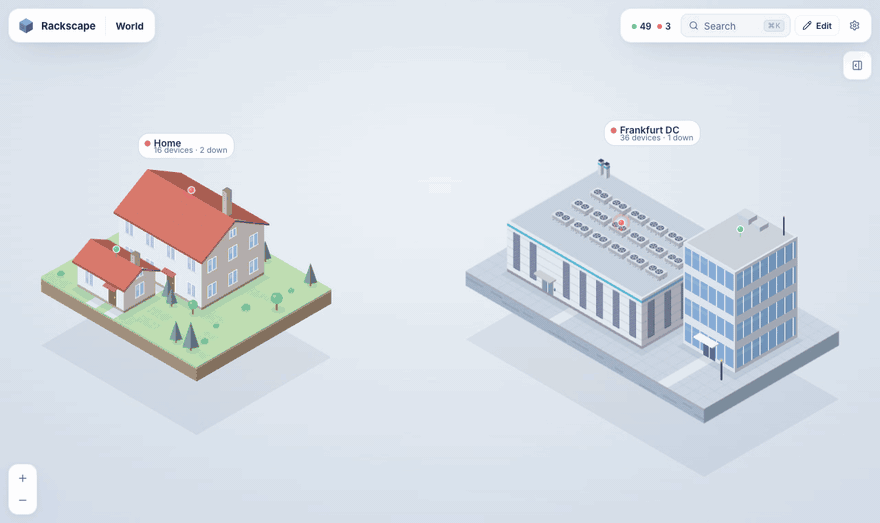
</p>

<p align="center">
  <a href="#-quick-start">Quick start</a> ·
  <a href="#-a-quick-tour">Tour</a> ·
  <a href="#-features">Features</a> ·
  <a href="#%EF%B8%8F-configuration">Configuration</a> ·
  <a href="#-development">Development</a>
</p>

---

Instead of a list of monitors, Rackscape gives you **one continuous world**. Click a site and the camera flies onto its island. Click a building and the roof lifts off. Click a rack and it fills the screen. Click a server and it slides out like a drawer while its VMs and services float above it as a hologram. Every LED, pin and beacon reflects the live state of your Uptime Kuma monitors.

## 🚀 Quick start

**Portainer:** *Stacks → Add stack → Repository*

| Field | Value |
| --- | --- |
| Repository URL | `https://github.com/yniverz/rackscape` |
| Compose path | `docker-compose.yml` |
| Environment | `KUMA_URL`, `KUMA_USERNAME`, `KUMA_PASSWORD`, `ADMIN_PASSWORD` |

Deploy, open `http://<host>:3000`, log in, press **Edit** and start building your world. To update later: **Pull and redeploy** with *Re-pull image* enabled – it only downloads the prebuilt image (`ghcr.io/yniverz/rackscape`, amd64 + arm64).

**Plain Docker:**

```bash
git clone https://github.com/yniverz/rackscape.git
```

```bash
cd rackscape && KUMA_URL=http://192.168.1.10:3001 KUMA_USERNAME=admin KUMA_PASSWORD=secret ADMIN_PASSWORD=change-me docker compose up -d
```

> **No Kuma yet?** Leave `KUMA_URL` empty and Rackscape starts in demo mode with a sample home and data center and fake, flapping monitors – everything in the pictures below is that demo.

## 🗺 A quick tour

### From the world down to a single service

Sites float as island plots. Status rolls up everywhere: a red pin on a roof means something inside that building needs attention.

<table>
  <tr>
    <td width="50%">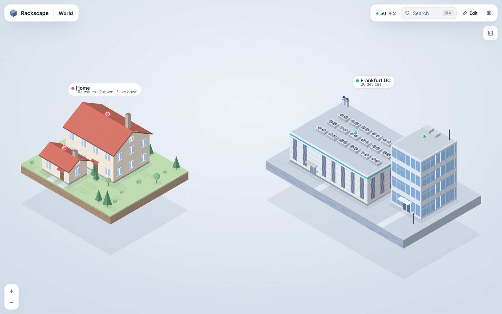</td>
    <td width="50%">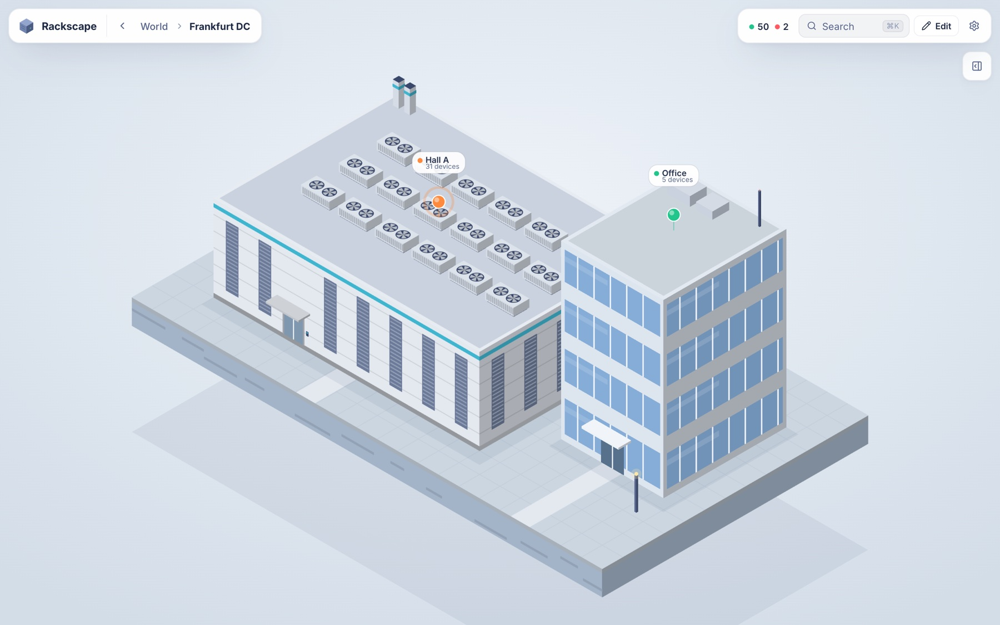</td>
  </tr>
  <tr>
    <td align="center"><sub><b>World</b> – every site at a glance</sub></td>
    <td align="center"><sub><b>Site</b> – residential, commercial, industrial and data center buildings</sub></td>
  </tr>
</table>

### Inside the buildings

Roofs lift off to reveal rooms, racks, desks and devices – each with a status pin and live LEDs. Desktop screens even turn red when a machine goes down.

<table>
  <tr>
    <td width="50%">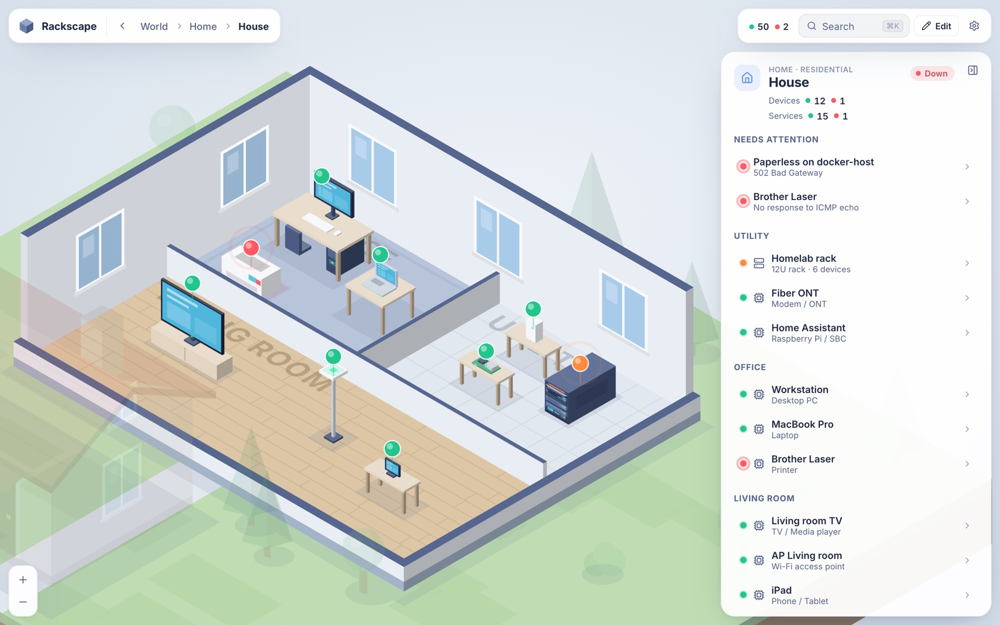</td>
    <td width="50%">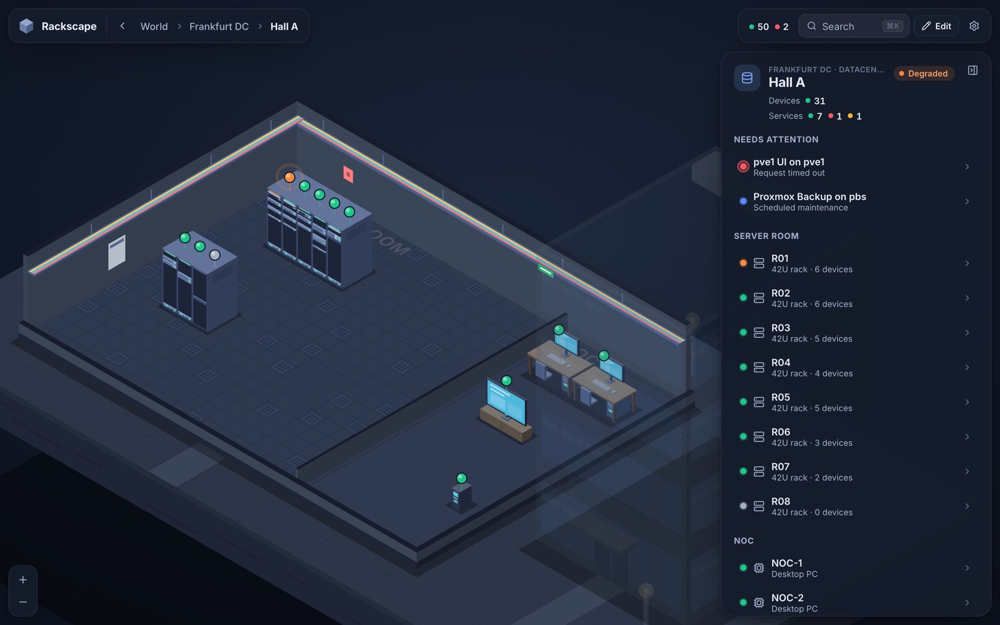</td>
  </tr>
  <tr>
    <td align="center"><sub><b>Homelab</b> – rooms, desks, TV, access point, a 12U rack</sub></td>
    <td align="center"><sub><b>Data center</b> – raised floor, cable trays, rack rows (dark mode)</sub></td>
  </tr>
</table>

### Racks, servers and what runs on them

Racks show every device with port and drive activity LEDs next to a rack elevation. Open a server and it slides out of the rack while its services, VMs and containers float above it – including the high-availability workloads of the cluster it belongs to.

<table>
  <tr>
    <td width="50%">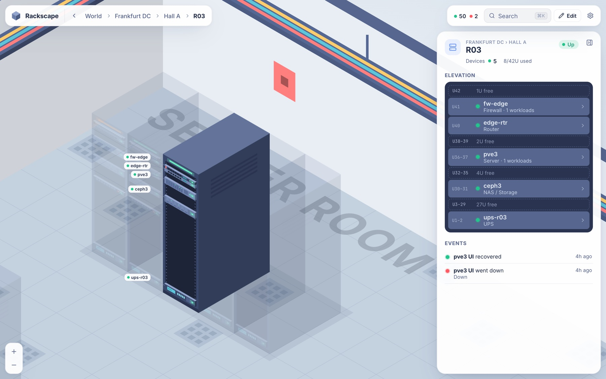</td>
    <td width="50%">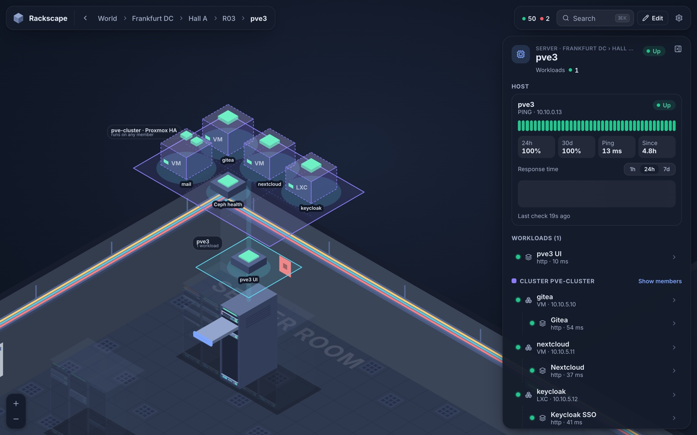</td>
  </tr>
  <tr>
    <td align="center"><sub><b>Rack</b> – devices, free units, events</sub></td>
    <td align="center"><sub><b>Server</b> – heartbeats, response times, services, VMs, HA workloads</sub></td>
  </tr>
</table>

### Clusters, high availability included

Group machines anywhere in the world into a cluster (Proxmox HA, Kubernetes, Swarm, …). Workloads that can run on any node live on the cluster, health is judged by quorum, and highlighting a cluster flies to all of its members.

<p align="center">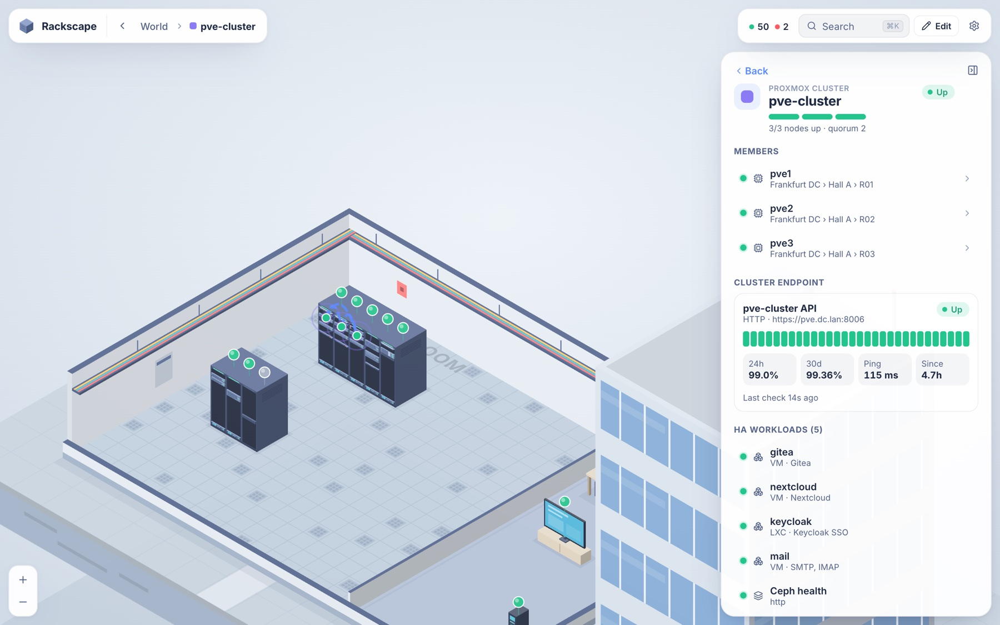</p>

### Build it in the browser

A full editor: add sites, buildings, rooms, racks and devices, drag them around (they snap to the floor grid), and link each one to Uptime Kuma monitors with a searchable picker that suggests matches by name or IP. Undo, autosave, version history and JSON import/export included.

<p align="center">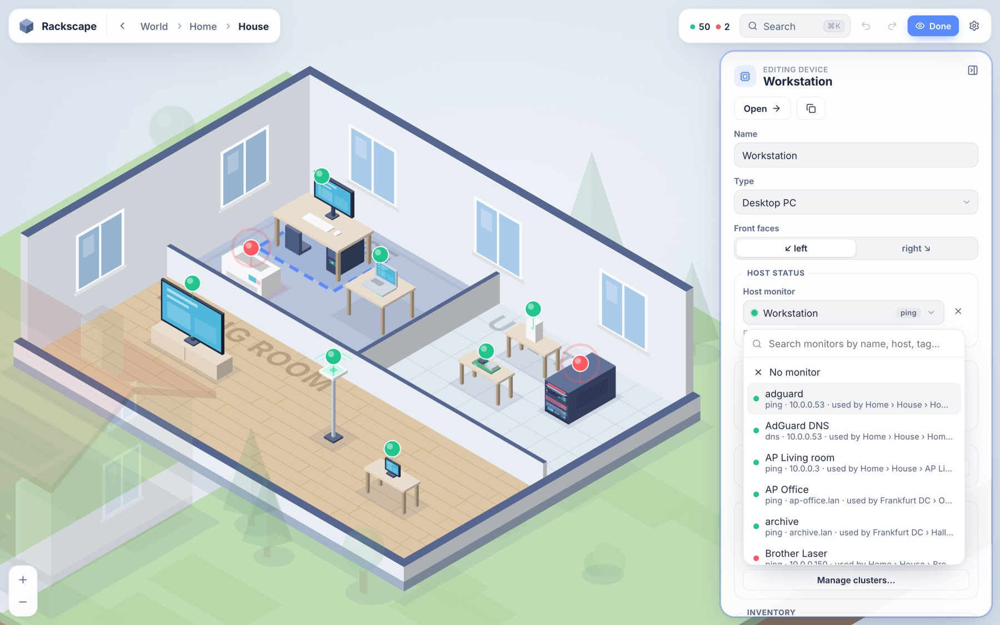</p>

### Find anything, anywhere

<kbd>⌘K</kbd> / <kbd>Ctrl K</kbd> searches every site, device, VM and service – and flies the camera straight to it.

<p align="center">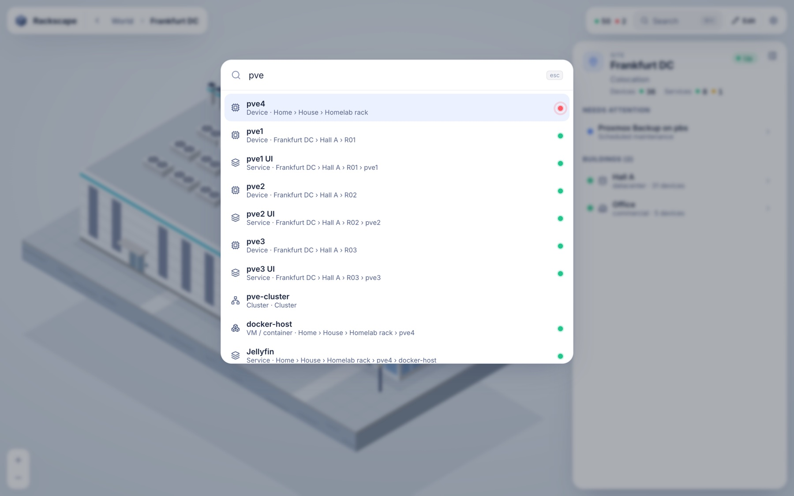</p>

### On your phone

<p align="center">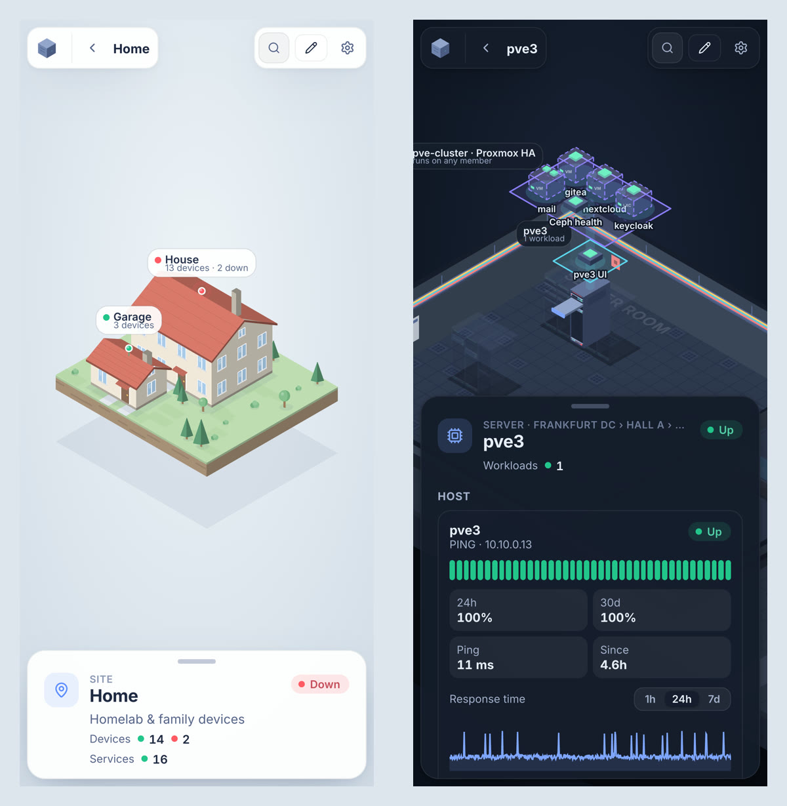</p>

## ✨ Features

|  |  |
| --- | --- |
| 🌍 **One world, many levels** | World → site → building → rack → machine → service in a single scene with smooth camera flights. Deep links via the URL, back with <kbd>Esc</kbd>. |
| 🎨 **Hand-drawn look** | Procedural SVG art: floating islands, houses, office towers, factories, data centers with spinning rooftop chillers, raised floors, racks with blinking port LEDs, desks, TVs, access points, cameras … |
| 🟢 **Live status** | LEDs, pins, rack status strips and roof beacons roll up the worst state inside (down › degraded › pending › maintenance › up). |
| 🖥 **Lots of device types** | Servers (1U–nU), switches, routers, firewalls, NAS, UPS, patch panels, PDUs, KVMs, tower servers, desktops, laptops, mini PCs, Raspberry Pis, modems, access points, cameras, printers, smart-home hubs, TVs, tablets, IoT. |
| 🧩 **Host + services** | Every device has a host monitor plus any number of services, VMs, LXCs and containers – each with their own monitors. |
| 🔗 **Clusters** | Proxmox HA, Kubernetes, Swarm: floating workloads, quorum-based health, animated member links. |
| 📈 **Details panel** | Heartbeat bar, response-time chart (1h/24h/7d), uptime 24h/30d, certificate expiry, last error, event log, inventory, rack elevation. |
| ✏️ **In-app editor** | Drag & drop with grid snapping and collision, rotate with <kbd>R</kbd>, monitor picker with suggestions, bulk-add from Kuma, undo/redo, autosave, version history, JSON import/export. |
| 🔔 **Alerts** | Toasts, optional desktop notifications, favicon and tab title follow the overall state. |
| 🌗 **Light & dark, mobile** | Follows your system theme; touch pan/pinch and a bottom sheet on phones. |
| 🔒 **Secure by default** | Login with rate limiting, signed sessions, strict CSP, server-side sanitising, read-only access to Kuma. |

## ⚙️ Configuration

| Variable | Default | Description |
| --- | --- | --- |
| `KUMA_URL` | – | Base URL of Uptime Kuma as reachable **from the container**. Without it the app runs in demo mode. |
| `KUMA_USERNAME` / `KUMA_PASSWORD` | – | Kuma credentials. Not needed if Kuma has authentication disabled. |
| `KUMA_TOTP_SECRET` | – | Base32 2FA secret, only if the Kuma account uses 2FA. |
| `KUMA_PUBLIC_URL` | `KUMA_URL` | Kuma URL as seen by your browser (for "open in Kuma" links). |
| `ADMIN_USERNAME` | `admin` | Login for Rackscape. |
| `ADMIN_PASSWORD` | generated | Printed to the log and stored in `/data/admin-password.txt` if unset. |
| `PUBLIC_READ` | `false` | Anyone may view without logging in; editing still requires login. |
| `AUTH_DISABLED` | `false` | No login at all (use behind Authelia/Authentik/VPN). |
| `DEMO_MODE` | auto | `true` forces fake data even when `KUMA_URL` is set. |
| `SESSION_DAYS` | `30` | Login lifetime. Changing `ADMIN_PASSWORD` logs out all sessions. |
| `TRUST_PROXY` | `loopback,linklocal,uniquelocal` | Which reverse proxies may set `X-Forwarded-*` (`true`, `false` or a list). |
| `FRAME_ANCESTORS` | `'self'` | CSP `frame-ancestors`, e.g. `'self' https://dash.example.com` to embed Rackscape in a dashboard. |
| `PORT` | `3000` | Host port in `docker-compose.yml` (the container always listens on 3000 there). |
| `DATA_DIR` | `/data` | SQLite database (layout, history, event log) and secrets. Mounted as a volume. |

> If Kuma runs in another stack on the same host, use the host IP, or attach both containers to a shared Docker network and use `http://uptime-kuma:3001`.

<details>
<summary><b>How the Kuma connection works</b></summary>

Uptime Kuma has no full REST API, so Rackscape connects like Kuma's own web UI: over Socket.IO, as a logged-in user. It receives the monitor list and live heartbeats in real time and asks Kuma for history when you open a detail panel. Kuma 1.x and 2.0–2.5 (socket login) as well as the newer better-auth based versions (cookie session) are detected automatically. The connection is read-only; nothing in Kuma is changed. A dedicated Kuma user is a good idea.

</details>

<details>
<summary><b>Security notes</b></summary>

- Put Rackscape behind HTTPS (e.g. your reverse proxy) when it is reachable from outside your LAN; the session cookie is marked `Secure` automatically on HTTPS.
- Logins are rate limited; sessions are HMAC-signed cookies (`HttpOnly`, `SameSite=Lax`). Cross-site write requests are rejected and a strict Content-Security-Policy is sent.
- Layout data is sanitised on the server: only `http(s)` links are kept, colours must be hex, numbers are clamped.
- Kuma with a self-signed certificate: set `NODE_TLS_REJECT_UNAUTHORIZED=0` (affects all outgoing TLS from this container) or use Kuma's plain HTTP URL inside your network.

</details>

<details>
<summary><b>Building the image yourself</b></summary>

Replace the `image:` line in `docker-compose.yml` with `build: .` and `pull_policy: build`. Building on the Docker host takes a few minutes per deploy.

</details>

## ⌨️ Using it

| | |
| --- | --- |
| **Navigate** | Click to go deeper · <kbd>Esc</kbd> or the breadcrumb to go back · drag to pan · scroll / pinch to zoom |
| **Search** | <kbd>⌘K</kbd> / <kbd>Ctrl K</kbd> or <kbd>/</kbd> |
| **Edit mode** | <kbd>E</kbd> or the **Edit** button |
| **Select / open** | Click to select · double-click to go inside |
| **Move** | Drag – snaps to the floor grid, hold <kbd>Alt</kbd> for ¼ steps, items don't overlap |
| **Rotate** | <kbd>R</kbd> turns the selected rack or device around |
| **Undo / redo** | <kbd>⌘Z</kbd> / <kbd>⇧⌘Z</kbd> |
| **Delete** | <kbd>Del</kbd> |

**Linking monitors:** select a device and choose its *host monitor* (drives the main LED), add *services* – or **From Kuma…** to add several at once – and *VMs & containers*. **Clusters:** *Manage clusters* → add members, HA VMs and cluster services; they appear above every member.

## 🛠 Development

```bash
npm install
```

```bash
npm run dev
```

Runs the API on `:3000` (demo mode unless `KUMA_URL` is set) and the Vite dev server on `:5173`.

```
server/   Fastify API, Kuma Socket.IO client, SQLite (node:sqlite), live SSE stream
shared/   world model + status types used by both sides
web/      React + Vite; web/src/scene is the isometric SVG renderer
```

Every entity in the world model (`shared/model.ts`) has a globally unique id, so upcoming features such as network topology views can reference sites, devices and services directly.

## 🧭 Roadmap

- Logical network view: networks, VLANs, VPN tunnels and site-to-site links drawn across the world
- Multiple floors per building
- More data sources (Prometheus, push agents)

## 📄 License

[NCPUL v1.3](./LICENSE.md) – free for non-commercial use.
